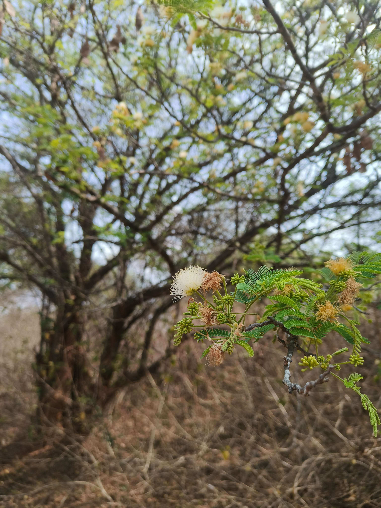
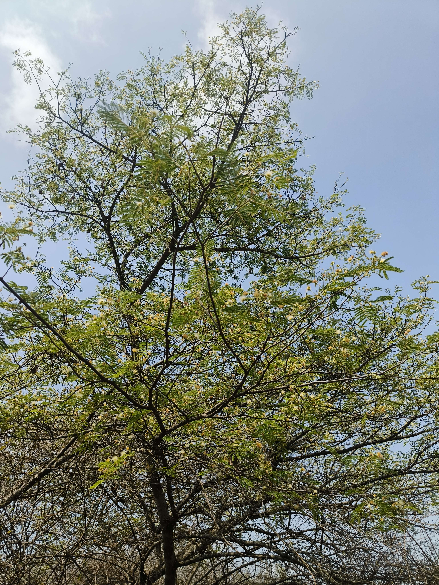
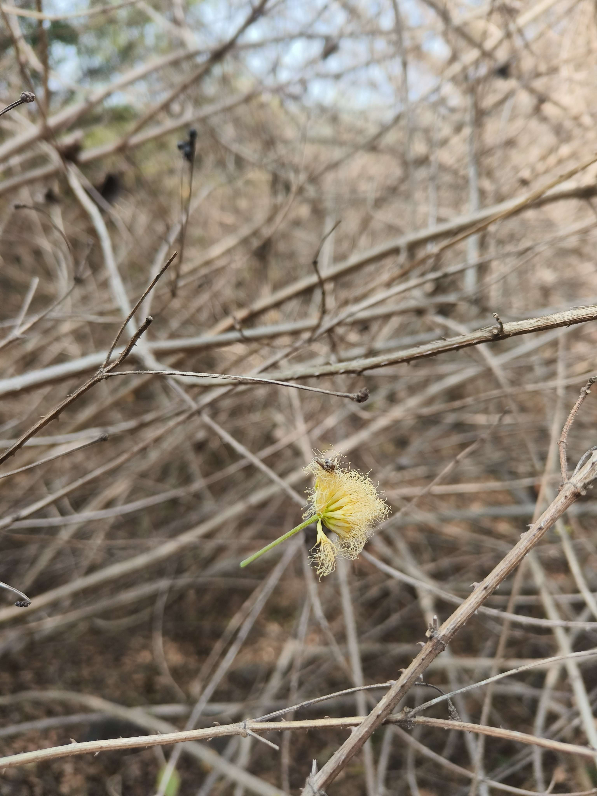
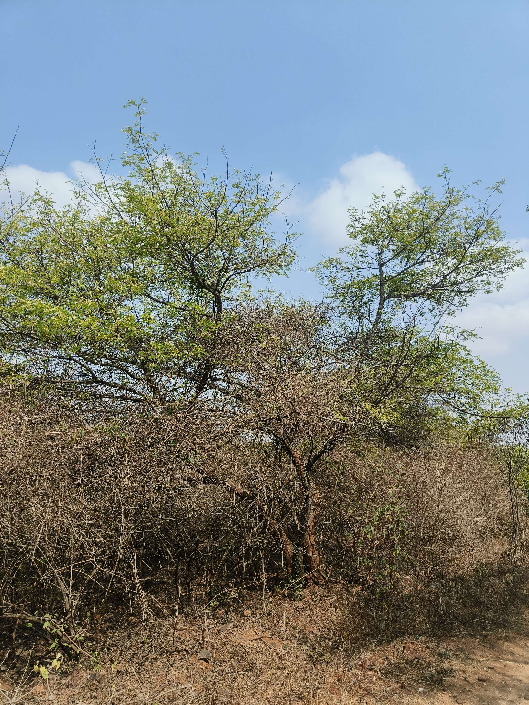
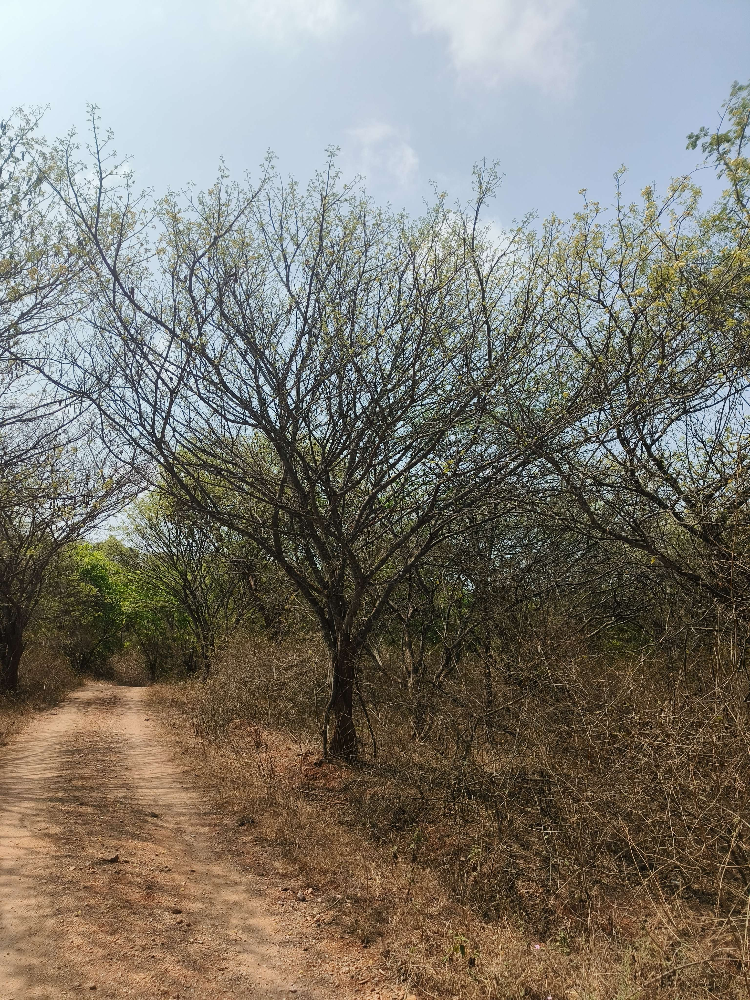
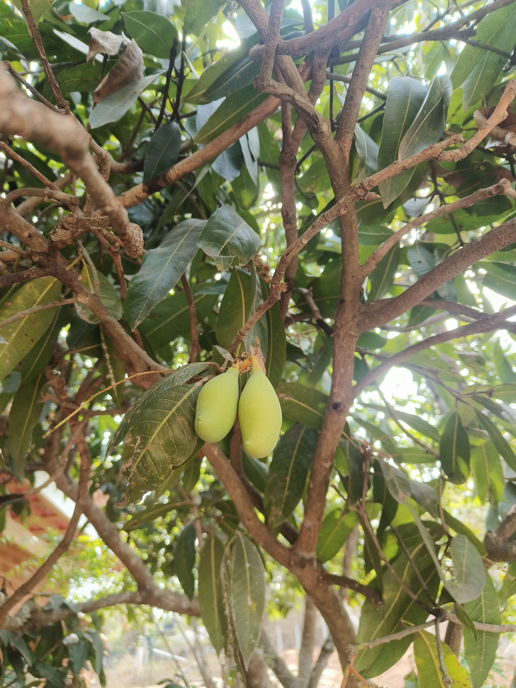

Summer rains seem to perfume the air with many fragrances, especially when you are around nature. Living among the mango trees on the farm, we have grown accustomed to the pleasant smell of mango blooms and fruit in this season. The other notable bouquet of smells comes from the neem flowers, and the pongai flowers. 

However, after a short summer rain, there is one fragrance that comes alive, and that is the mild, subtle and sweetish fragrance of Sigara flowers. Sigara is the name locals use, which might have come from one of the Kannada names of the tree, 'chiggare'. Scientifically called 'Albizia Amara', it is a deciduous tree with small leaves and lovely powder puff flowers. 

The fragrance is so subtle that you will not even notice it except in the spring, which is now. Even then, you can only feel it when the earth has gotten a little wet, and the smell of the earth after a breif summer shower and the fragrance of Sigara go so well together!

What a blessing it is to be able to take a mid-morning walk in the forest on a day like this!!

The mango showers, as the early March rains are called around here, are a blessing for the mango trees, helping the tender mango fruit to grow and mature. This time, we have not had many of them, the mango trees seem to be doing fine on their own and we have fingers crossed for the harvest.

