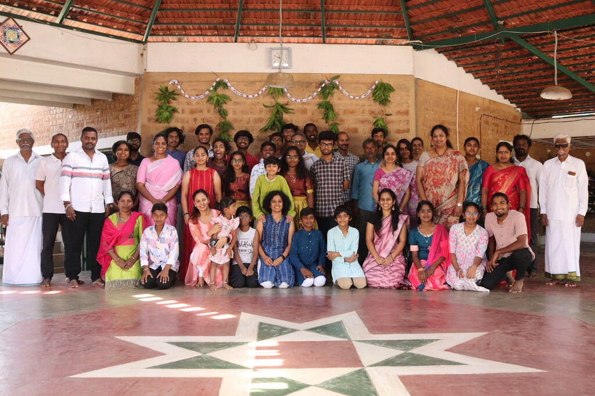
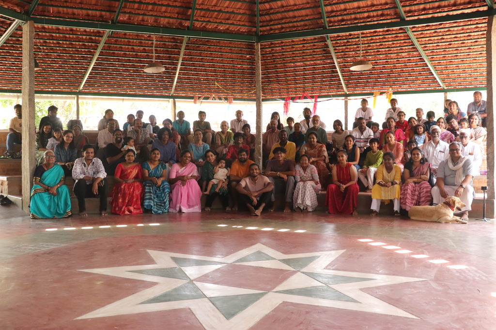
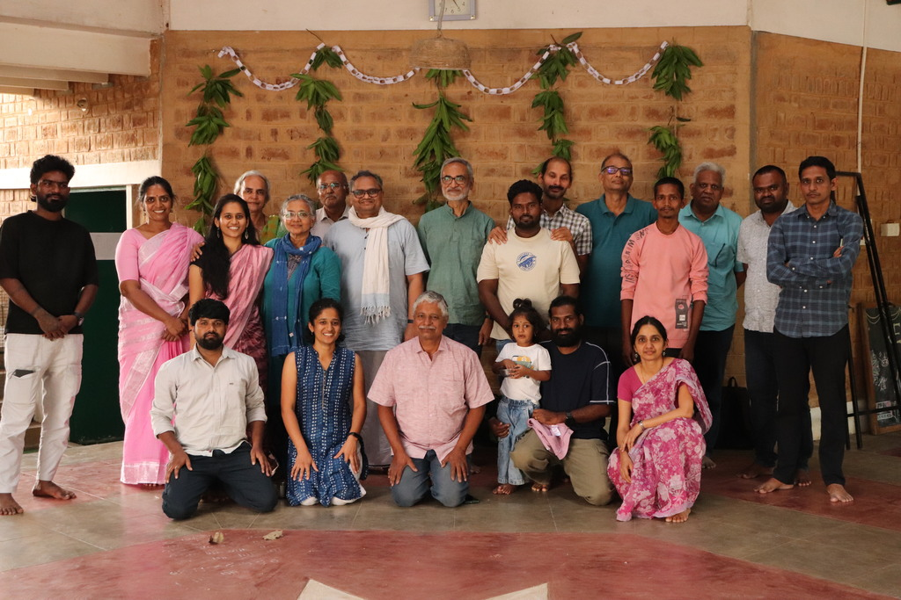
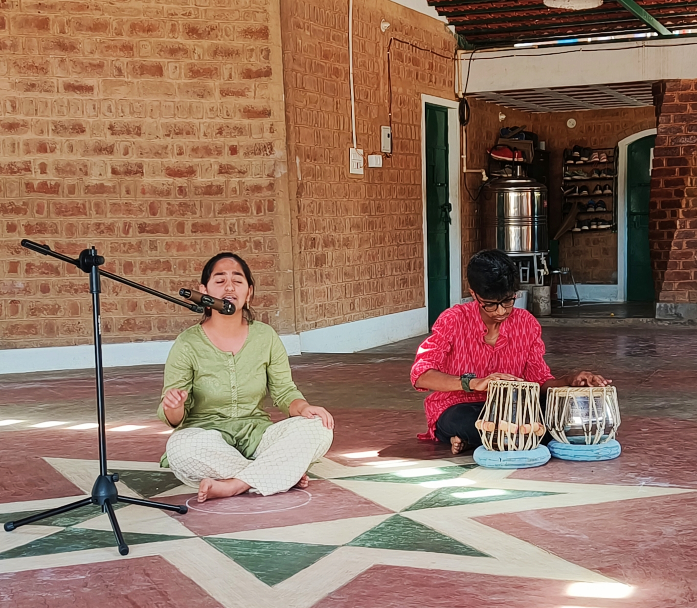
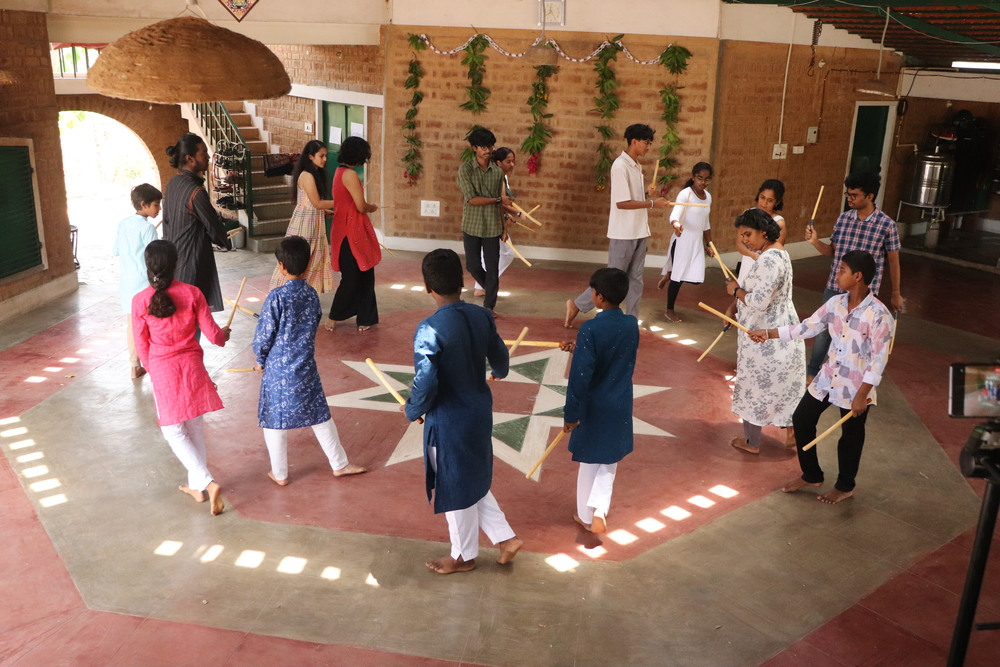
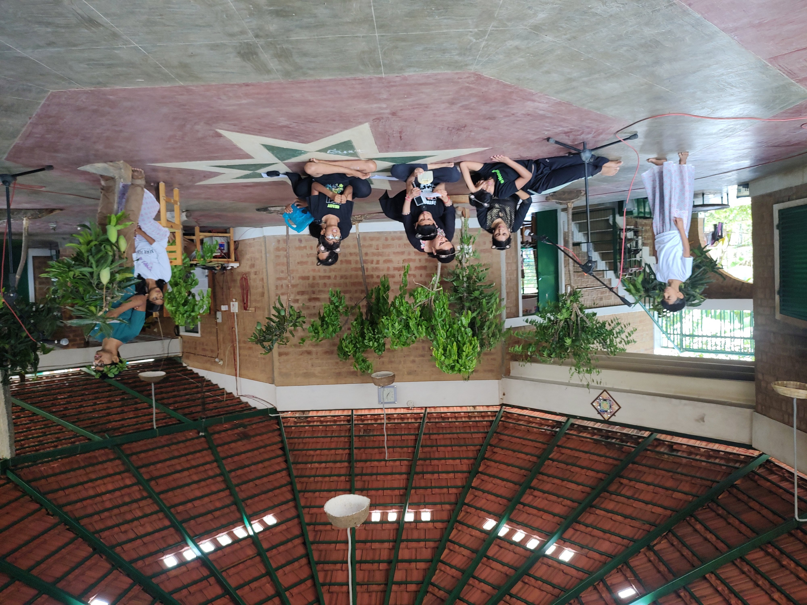
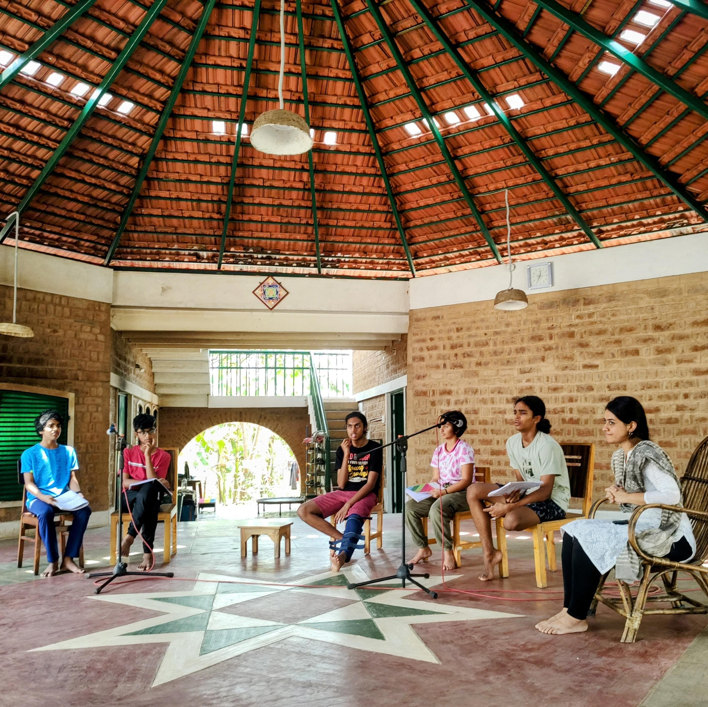
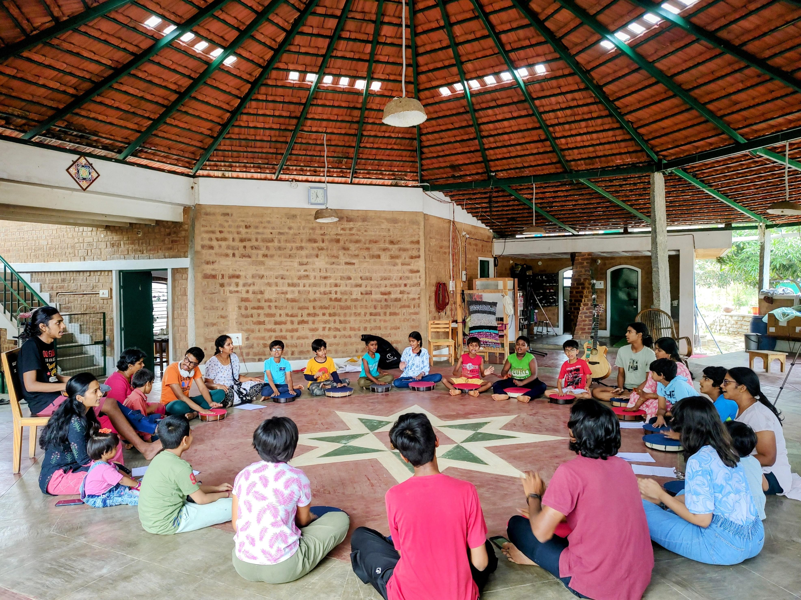

::: {.container}

::: {.grid}

::: {.g-col-12 .g-col-md-6}
{fig-align="left"}
:::

::: {.g-col-12 .g-col-md-6}

### Dates: 11th and 12th April 2026

[location](https://maps.app.goo.gl/k1bMSgVcrn2NLexy5) - about 1.5 hr drive from Bangalore. 

Let us know about your visit on this [RSVP form](https://forms.gle/c93vqENrVhDQk6q16). 

Koodali is the annual gathering of the Farm Hill community - it is the time of the year when all of us come together to celebrate the spirit of the community. 

Active members of the community, our friends, well wishers, as well as other interested people participate in a variety of activities over two days, on the Farm Hill Learning Campus near Shoolagiri, Tamil Nadu. 

For more information and any assistance, write to us using the [contact form](/contact/index.qmd) or use the WhatsApp link on the website to text us!

Looking forward to see you all!

#### Team Farm Hill 

:::
:::
:::

::: {.container}

::: {.grid}

::: {.g-col-12 .g-col-md-6}

### **Celebrating Subba - 2pm, 11th April**

Subba was our friend, guide and philosopher, and in many ways the inspiration for the Farm Hill community. We will be celebrating his life and legacy in this event. We will be sharing stories, memories and reflections about Subba, and how his teachings and presence have shaped not only our community but also a number of friends. We will also be sharing some of the things that we have learned from Subba, and how we can continue to carry forward his vision and values in our lives and work.

We request all people who have ever known him to come and share their stories and reflections about Subba. 

:::

::: {.g-col-12 .g-col-md-6}

:::

:::
:::

### Glimpses from previous editions of Koodali

::: {.container}

::: {.grid}

::: {.g-col-12 .g-col-md-4}

:::

::: {.g-col-12 .g-col-md-4}

:::

::: {.g-col-12 .g-col-md-4}

:::

:::
:::

::: {.container}

::: {.grid}

::: {.g-col-12 .g-col-md-4}

:::

::: {.g-col-12 .g-col-md-4}

:::

::: {.g-col-12 .g-col-md-4}

:::

:::
:::

::: {.container}

::: {.grid}

::: {.g-col-12 .g-col-md-4}

:::

::: {.g-col-12 .g-col-md-4}

:::

::: {.g-col-12 .g-col-md-4}

:::

:::
:::

